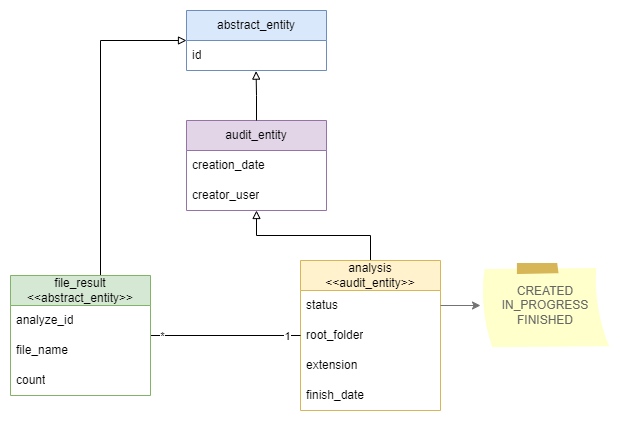
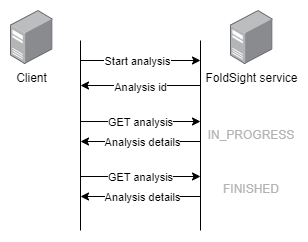

:toc: left
:toclevels: 4
:sectnums:
:sectnumlevels: 4
:source-highlighter: rouge
:rouge-style: thankful_eyes
:icons: font

= FoldSight

The FoldSight (folder insight) application assists in performing various folder management operations.

This project is the interview task for OTP Bank.

== Entity diagram

The following diagram illustrates the relationships between the key entities in the database schema.

=== Tables

The database schema consists of several tables. Below are the details for each table:

**Analysis**

The `analysis` table stores information about different analyses.

**File Result**

The `file_result` table contains information about file results related to analyses.

For more details on the database schema, please refer to the corresponding Liquibase XML changelog files.

== API Endpoints

The following endpoints are available in the application:

=== Start Analysis

Initiates a new analysis. Returns an analysis ID that can be used with the GET endpoint to check the status. Two analyses with the same source folder cannot be started at the same time.

=== Get Analysis

Retrieves the current status of the analysis. If the status is IN_PROGRESS, the analysis is not yet complete.

=== Query Analysis

Queries the analyses in the system with filtering and pagination parameters.

== Analysis Process

The analysis process involves the following steps:

=== Starting a New Analysis

In the first step, the client initiates a new analysis by calling the `START` endpoint. This triggers the processing to begin asynchronously in the background. The client receives a unique analysis ID, which can be used to track the progress of the analysis.

* **Endpoint**: `/api/analysis/start`
* **Method**: `POST`

=== Tracking the Analysis

In the second step, the client uses short-polling by calling the `GET` endpoint to track the progress and results of the analysis. This endpoint provides access to intermediate results as well. The analysis should be considered complete and the results final when the status of the analysis is `FINISHED`.

* **Endpoint**: `/api/analysis/{id}`
* **Method**: `GET`

=== Status and Results

* **IN_PROGRESS**: The analysis is still running.
* **FINISHED**: The analysis is complete, and the results are final.

Using these steps, clients can effectively manage and track the analysis operations provided by the FoldSight service.
